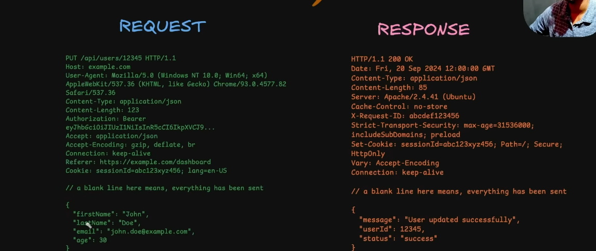

# HTTP
The HTTP protocol is a stateless protocol, which means that each request is independent of the previous request. It follows a client-server model, which means that the client makes a request to the server and the server responds(sends back data) to the client with a status code and once the response is sent, the connection is closed.

<!-- $ NOTE 
Client–Server Model
- The client (browser, app, etc.) sends a request.
- The server processes it and sends back a response (HTML, JSON, etc.).The server sends back the resource with a status code (e.g., 200 OK).
- Connection Ends → Unless using persistent connections (HTTP/1.1+), the connection closes after the response.
-->

there are maily 2 ideas that are used in HTTP or we can say why we use http: 

1. stateless : 
    It is a stateless protocol, meaning that it does not maintain any information about previous requests or responses.After the server response to the client, the connection is closed and the server does not keep track of the client's state/any data.

    Benefits:
        - Simplicity: Server architecture is simpler since no session state needs to be tracked.
        - Scalability: Requests can be distributed across multiple servers without worrying about shared state.
        - Fault Tolerance: If a server crashes, no client state is lost because nothing is stored between requests.

    ? When State Is Needed:
    Developers add mechanisms like cookies, sessions, or tokens (JWT) to maintain continuity (e.g., user login, shopping cart).

2. client-server model : 
    - HTTP follows a client–server architecture.
        - Application layer : In the client-server model, HTTP acts as an application layer protocol that facilitates communication by handling request/response semantics. 
        - Transport layer : To transmit data, it relies on transport layer protocols to establish connections(ordered, error‑checked, retransmitted if lost).
    - In OSI model, HTTP is at application layer and TCP is at transport layer and backend engineers only handle this application layer protocol designing endpoints, handling requests/responses, and implementing authentication, while TCP reliability is abstracted away.

    
# HTTP itself is an application layer protocol. To actually send and receive requests/responses, it relies on transport layer protocols underneath. Two main ones are used:

There are 2 transport layer protocols used in http: 
    1. TCP (Transmission Control Protocol): mostly used by http
        Usage: Used by HTTP/1.1 and HTTP/2.
        Reliability: It is highly reliable because it uses a "three-way handshake"(SYN → SYN-ACK → ACK) to establish a connection and guarantees that data arrives in the correct order without errors or loss.
        Function: If a packet is lost, TCP automatically manages its retransmission before the application can proceed.

    2. UDP (User Datagram Protocol) : 
        Usage: Used by the latest version, HTTP/3, via a new protocol called QUIC.
        Speed & Latency: UDP is connectionless and faster because it eliminates the overhead of the TCP handshake.
        HTTP/3 Integration: Standard UDP is "unreliable" (no delivery guarantees), but HTTP/3 over QUIC adds a custom layer of reliability on top of UDP. This prevents "head-of-line blocking," where one lost packet stops all other data streams in a single connection. 

👉 So the evolution is:
- HTTP/1.1 & HTTP/2 → TCP (reliable, but slower due to handshake and head‑of‑line blocking).
- HTTP/3 → UDP + QUIC (faster, modern reliability layer, avoids blocking).

# HTTP versions 

1. HTTP/0.9 (1991) – The "One-Line" Protocol
Capabilities: Extremely minimal; it only supported the GET method.
Response: The server sent only the raw HTML file without any headers or status codes.
Limitation: It could only transfer plain text HTML files. 

2. HTTP/1.0 (1996) – Building Extensibility
New Features: Introduced HTTP headers, allowing for metadata transmission and different file types via the Content-Type header (images, scripts, etc.).
Methods: Added POST and HEAD.
Status Codes: Added response codes (e.g., 200 OK, 404 Not Found) to indicate success or failure.
Limitation: A brand-new TCP connection was required for every single request, causing high overhead for pages with multiple assets. 

3. HTTP/1.1 (1997) – The Standardized Workhorse
Persistent Connections: Connections could be reused for multiple requests (Keep-Alive), significantly reducing latency.
Host Header: Allowed multiple websites to be hosted on a single IP address (virtual hosting).
Chunked Transfer: Supported sending large data in smaller pieces to improve initial rendering.
Limitation: Suffered from Head-of-Line (HoL) Blocking—if one request was slow, it blocked all others following it on that same connection.

4. HTTP/2 (2015) – Performance Through Multiplexing
Binary Protocol: Switched from text-based to a binary format, making it more efficient for machines to parse.
Multiplexing: Allowed multiple requests and responses to be sent simultaneously over a single TCP connection, solving application-layer HoL blocking.
Header Compression (HPACK): Used a compression algorithm to reduce the size of redundant headers.
Server Push: Enabled servers to proactively send resources to the client’s cache before they were explicitly requested.
Limitation: While it fixed HoL blocking at the application layer, TCP-level HoL blocking remained—if a single packet was lost, all streams on that connection were paused until it was recovered. 

5. HTTP/3 (2022) – The Modern Web over QUIC
Transport Layer Shift: Replaced TCP with QUIC, which runs over UDP.
Eliminating HoL Blocking: Because QUIC handles streams independently at the transport layer, a lost packet in one stream no longer blocks other streams.
Zero Round-Trip Time (0-RTT): Clients can send data immediately to previously visited servers without waiting for a full handshake.
Connection Migration: Connections are identified by a "Connection ID" rather than an IP address, allowing a seamless transition (e.g., switching from Wi-Fi to mobile data without dropping the connection).
Built-in Security: Unlike previous versions where TLS was an optional layer, HTTP/3 has TLS 1.3 encryption mandatory and built directly into the protocol.

# so basically client and servers made network connection and messages are sent and received in a request-response cycle.
## Http messages => these are the req-res messages that are sent and received in a request-response cycle.

# Http headers :
Key value pairs that are sent with the request or response. 
Types of headers : 
1. Request headers : 
    Provide details about the client or its origin.
    Host: The domain name and port of the target server (mandatory in HTTP/1.1).
    User-Agent: Identifies the client software and version.
    Referer: The address of the previous web page from which a link was followed.

2. General headers : 
    Provide information about the message itself, such as its version, length, and transfer encoding.
    it stores about date of the message, diff cache mechanism,connection etc.

3. Representation headers : 
    Provide information about the representation of the message, such as its content type,content-length,content-encoding, and language.

4. security headers : 
    Provide information about the security of the message(strict-transport-security),  content type(content-security-policy),x-frame-options,x-content-type-options,set-cookie.

